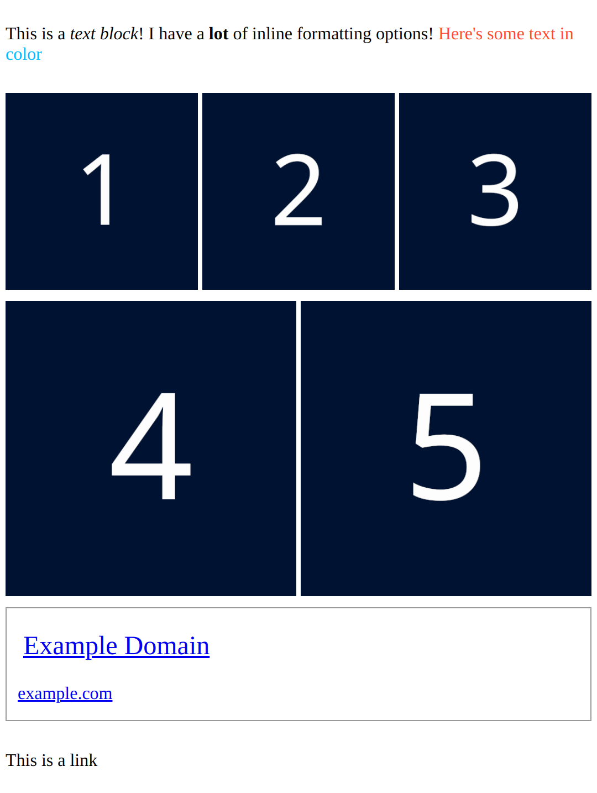

# npf-renderer

A Python library for rendering Tumblr's Neue Post Format (NPF) into HTML

<details>
<summary>
Output
</summary>



</details>

## Usage:

```python 
import pytumblr
import npf_renderer

client = pytumblr.TumblrRestClient(*TUMBLR_API_KEYS)

blog = client.posts(BLOG_NAME, npf=True)
post = blog["posts"][0]

content, layout = post["content"], post["layout"]

has_error, post_html = npf_renderer.format_npf(content, layout, pretty_html=True)

print(post_html)
```

<details>

<summary>
HTML
</summary>

```html
<div class="post-body">
  <div class="layout-row">
    <p class="text-block">
      <span class="inline-formatted-content">This is a <i class="inline-italics">text block</i>! I have a 
        <b class="inline-bold">lot</b> of inline formatting options! 
        <span class="inline-color" style="color: #ff4930;">Here's some text in </span>
        <span class="inline-color" style="color: #00b8ff;">color</span>
      </span>
    </p>
  </div>
  <div class="layout-row">
    <figure class="image-block">
      <div class="image-container">
        
      </div>
    </figure>
    <figure class="image-block">
      <div class="image-container">
        
      </div>
    </figure>
    <figure class="image-block">
      <div class="image-container">
        
      </div>
    </figure>
  </div>
  <div class="layout-row">
    <figure class="image-block">
      <div class="image-container">
        
      </div>
    </figure>
    <figure class="image-block">
      <div class="image-container">
        
      </div>
    </figure>
  </div>
  <div class="layout-row">
    <div class="link-block">
      <a class="link-block-link" href="https://href.li/?https://example.com">
        <div class="link-block-title">
          <span>Example Domain</span>
        </div>
        <div class="link-block-description-container">
          <div class="link-block-subtitles">
            <span>
              <span>example.com</span>
            </span>
          </div>
        </div>
      </a>
    </div>
  </div>
  <div class="layout-row">
    <p class="text-block">This is a link</p>
  </div>
```

</details>

<br/>

<details>
<summary>
Output
</summary>


</details>

<br/>

**Make sure to import the CSS from `npf_renderer.utils.BASIC_LAYOUT_CSS`!**

```python
with open("basic_layout.css", "w") as file:
    file.write(npf_renderer.utils.BASIC_LAYOUT_CSS)
```

`format_npf` will return placeholder HTML for any blocks it doesn't support.


<details>
<summary>Unsupported blocks</summary>

```html
<div class="post-body">
  <p class="text-block"> This text block is supported but the next block is not! </p>
  <div class="unsupported-content-block">
    <div class="unsupported-content-block-message">
      <h1>Unsupported content placeholder</h1>
      <p>Hello! I'm a placeholder for the unsupported "poll" type NPF content block. Please report me!</p>
    </div>
  </div>
</div>
```

</details>

<br/>

In the event that it cannot format anything an empty div will be returned

---

## Installation

```bash
git clone "https://github.com/syeopite/npf-renderer"

pip install ./npf-renderer
```

## Advanced

You can pass in a custom URL handler function to `format_npf` to replace any links within the NPF tree.

```python
def url_handler(url):
    url = urllib.parse.urlparse(url)

    if url.hostname.endswith("example.com"):
        return url._replace(netloc="other.example.com").geturl()

format_npf(contents, layouts, url_handler=url_handler)
```

You can also pass in an subclassed `Parser`, `LayoutParser` or `Formatter` object to `format_npf` to customize its behavior on all parts of the chain.


## Features

- [x] Text blocks
- [x] Image blocks
- [x] Link Blocks
- [ ] Audio Blocks
- [ ] Video Blocks
- [ ] Polls Blocks

- [x] Layouts 
- [x] Attributions [Partial]
